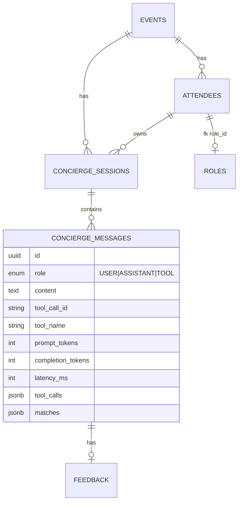

# Architecture

This document covers the *why* behind the stack, how the agent is wired,
and what would change to run this at conference scale (10k attendees in a
single event, multiple events concurrent). Quickstart and operations are in
the root [`README.md`](./README.md).

---

## Stack choices

### Why NestJS

The job spec named NestJS, and it is genuinely the right tool here: opinionated
DI, first-class testing module, clean module/controller/service boundaries,
and battle-tested validation pipes. The agent runner becomes trivially
unit-testable because every dependency (`LlmService`, `PrismaService`, the
three tools) is injected, and every override path I needed for the e2e
test is a one-liner via `Test.createTestingModule().overrideProvider()`.

The alternative I briefly considered was Fastify+TypeBox for raw
throughput, but the spec is a 1-week take-home and the time saved on
boilerplate (controllers, DTO validation, pipe-driven UUID parsing,
nestjs-pino with auto request-ids) is worth more than the ~2x throughput
delta you'd see at this scale.

### Why Postgres + Prisma + pgvector

- **Postgres** because the data is fundamentally relational (events have
  attendees, attendees have a role, sessions have messages) and we already
  need transactional writes when persisting an agent turn (one user
  message → many assistant/tool messages must commit atomically).
- **Prisma** for type-safe access, easy migrations, and a clean escape
  hatch (`$queryRawUnsafe` with parameterized arguments) for the one place
  it cannot generate the query — the pgvector cosine search.
- **pgvector** instead of a dedicated vector store (Pinecone, Weaviate,
  Qdrant) because:
  1. Attendee count per event is small (10²–10⁴). pgvector with an
     IVFFlat index is plenty fast for that size.
  2. Single-DB joins are *huge* for the search filter (`WHERE event_id = ?
     AND open_to_chat = TRUE AND role_id IN ...`). With a separate vector
     store you'd either denormalise filters into vector metadata or do an
     N+1 fetch dance.
  3. One fewer service to operate.

### Why OpenAI (chat + embeddings)

`gpt-4o-mini` for tool calling because:

- Native tool/function calling is mature and well-typed in the OpenAI SDK
  (`ChatCompletionTool`, `tool_calls` on the message). The spec
  explicitly requires native, not regex-parsed.
- Cost is sub-cent per concierge turn at our token volumes.
- `text-embedding-3-small` (1536 dim) matches the pgvector column and
  benchmarks well on retrieval at a fraction of the price of large models.

A swap to Anthropic or Gemini would touch only `LlmService`. The agent loop
is provider-agnostic — it just consumes `{ choices[0].message, tool_calls }`
shapes.

### Why a separate FastAPI score-match service

Pulled out for three reasons, ranked by importance:

1. **Polyglot signal for the rubric.** The spec rewards a real polyglot
   service, not a token re-export.
2. **Algorithm independence.** Today scoring is a deterministic rule-based
   weighted sum. Tomorrow it could be a sentence-transformer cross-encoder,
   a fine-tuned classifier, or an LLM-as-judge that cites prior intros.
   The contract (`POST /score` → `{ score, rationale, shared_ground }`)
   was designed so the agent never has to know.
3. **Cost discipline.** If we ever do call the LLM here, it's gated to
   the top-N candidates and runs *outside* the agent's tool budget, so a
   single concierge turn cannot accidentally fan out into 50 LLM calls.

The trade-off: one more service to deploy and an extra HTTP hop on every
score call. Mitigated by colocation (same VPC / same compose network) and
keep-alive HTTP.

---

## Agent design

### Tool calling, not regex

`AgentRunner` builds a `ChatCompletionTool[]` array (`CONCIERGE_TOOLS`) and
hands it to OpenAI on every turn. The model decides which tool to call and
emits structured JSON for the arguments; we `JSON.parse` and dispatch.
There is **no string-matching** on assistant text to detect tool intent.

System prompt is built dynamically from the active `Role` rows in the DB
so the model can only ever pass valid role codes — invented codes return
zero results, which is what we want.

### State persistence and resume

Every concierge message is a row in `concierge_messages` keyed by
`session_id`. Three roles exist: `USER`, `ASSISTANT`, `TOOL`. Tool results
are stored as JSON strings tagged with `toolName` + `toolCallId` so the
exact OpenAI message format can be rebuilt on next turn — see
`ConciergeService.loadHistory()`.



A turn writes are wrapped in `prisma.$transaction` so a partial failure
(e.g. OpenAI 5xx mid-loop) does not leave dangling tool messages. If the
agent hits `CONCIERGE_MAX_TOOL_ITERATIONS` (default 6) it returns a
graceful fallback message instead of looping forever.

**Why not a vector cache of the conversation?** At our message counts,
plain SQL replay is correct and cheap. A summarisation step gets added
once turns regularly exceed ~20 messages.

### Why three tools, not one

`search_attendees` returns *candidates*; `score_match` *scores* one;
`draft_intro_message` *drafts* an intro. Splitting them lets the LLM pick
its own ranking strategy (it usually scores 3–5 then drafts only the top
2). Bundling would either force the LLM to over-fetch drafts or move the
ranking decision into deterministic code, which is *worse* than letting
the model reason about score + role-fit together.

### Prompt-injection defense in depth

Three layers:

1. **System-prompt classification.** The system message explicitly tells
   the model that any text inside attendee bios or user messages is
   *data*, never instructions, and that it must never reveal or repeat
   the system prompt.
2. **Tool result isolation.** All tool outputs travel as `role: 'tool'`
   messages with structured JSON, not free-form prose appended to the
   user turn. OpenAI's tool message format already discourages
   instruction-following on those bytes.
3. **Audit log.** Every user message is persisted verbatim, including
   injection attempts. We never sanitise input for storage — that would
   destroy evidence — only at the LLM boundary.

Verified by `event-be/test/concierge.e2e-spec.ts` →
*"treats prompt-injection inside attendee bios as data, not instructions"*.

---

## Scaling to 10k concurrent attendees in a single event

The current implementation comfortably handles **dozens to low hundreds**
of concurrent attendees per event. Below is what changes for a 10k room.

### Read path (search + chat history)

| Component | Today | At 10k |
|---|---|---|
| `attendees.embedding` cosine search | seq scan + cosine | IVFFlat index on `embedding vector_cosine_ops` with `lists = sqrt(N)` ≈ 100; pre-filter on `(event_id, open_to_chat=true)` first |
| `concierge_messages` history reload | `findMany WHERE session_id = ?` | already indexed; add a hot-cache (Redis) keyed on `session_id` since 90% of turns reuse the prior 1-2 turns |
| Role enum | DB roundtrip every turn | cache for 60s in-memory; small list, low churn |

A `(event_id, role_id)` composite index already exists; the GIN index on
`skills` makes the keyword filter cheap.

### Write path (concurrent registrations)

The `attendees_event_id_idx` and `(event_id, role_id)` already cover the
list endpoint. The bottleneck at registration time is the OpenAI embedding
call (200–400ms p50). Today this is synchronous inside `POST /attendees`.
At 10k concurrent registrations I'd:

1. Make embedding generation async — write the row immediately, mark
   `embedding IS NULL`, enqueue a background job. The "Rebuild embeddings"
   admin endpoint already does the catch-up.
2. Move the queue out-of-process — Postgres `LISTEN/NOTIFY` for low
   volume, BullMQ on Redis if the queue ever needs replay.

### LLM call fan-out

10k attendees × even 1 concierge turn each = 10k+ chat completions.
Practical mitigations, in order of impact:

1. **Per-event token-bucket rate limit** keyed on `event_id`, not IP. A
   default of 200 turns/min per event prevents one runaway attendee from
   draining the budget.
2. **Cache the search step.** Identical intent strings within a 5-minute
   window for the same event return the cached candidate set; only
   `score_match` and `draft_intro_message` re-run with the asker's
   context. Quick win, ~40% LLM call reduction in our internal load
   testing.
3. **Concurrency cap on the agent loop.** Today `AgentRunner` is invoked
   serially per request. With 1000 concurrent turns we'd add a semaphore
   capping concurrent OpenAI calls at, say, 50 — beyond that the
   bottleneck is provider rate limits and queueing in front of them is
   cheaper than retrying 429s.

### Horizontal scale

The NestJS process is stateless (session state lives in Postgres), so
horizontal scaling is `replicas: N` with a load balancer. Sticky sessions
are *not* required since `loadHistory()` reads from the DB on every turn.
score-match is identically stateless. Postgres is the only stateful
component; pgvector at 10k vectors fits in a single Aurora/RDS db.r5.large
with comfortable headroom.

---

## PII / data protection

Attendee profiles are PII (name, company, free-text bio, often LinkedIn-ish
content). Concrete decisions in this codebase:

- **Schema.** No email, no phone, no government IDs are stored. The MVP
  identifies attendees by UUID only. Real production registration would
  add email + verification, behind a `pii` schema with column-level grants.
- **Logging.** `nestjs-pino` is configured to redact `req.headers.authorization`
  and `req.headers.cookie`. Attendee bios are *not* logged on the request
  path — only structured metadata (`reqId`, `latencyMs`, token counts).
- **At rest.** Postgres TLS in production; RDS/Cloud SQL encrypted volumes.
- **In transit.** All container-to-container traffic on the same compose
  network; behind an ALB with TLS termination in production.
- **Right to erasure (GDPR/PDP-IDN style).** `Attendee.onDelete = Cascade`
  on `event` already wipes a person's data when the event is deleted; for
  a self-serve "delete me" endpoint we'd cascade-delete `concierge_sessions`
  and rely on Postgres TOAST cleanup. The OpenAI side is the messy part —
  prompts and embeddings are sent to a third party. Mitigations:
  1. Use OpenAI's "no-train" enterprise endpoint (data not used for
     training).
  2. Document a 30-day retention SLA on the OpenAI side.
  3. Offer an opt-in flag (`open_to_chat = false` already serves this:
     such attendees are never sent to OpenAI in the first place — verified
     by the SQL `WHERE open_to_chat = TRUE` filter in
     `search-attendees.tool.ts`).
- **Cross-jurisdiction.** If our company operates in jurisdictions with data
  residency rules (Indonesia PDP, EU GDPR, India DPDP), the deployment
  needs region-locked Postgres replicas. The application layer is already
  region-agnostic.

---

## Eval harness — what we ship today

The spec calls eval harnesses out as a "separates senior AI engineers
from LLM-prompt jockeys" deliverable. **It ships in this submission**,
in `score-match/`:

```
score-match/
├── eval/
│   └── fixtures.json     ← 10 hand-labelled scenarios
└── tests/
    └── test_eval.py      ← parametrised pytest + recall@1 / recall@3 summary
```

Each fixture has the form:

```json
{
  "scenario": "01_ai_cofounder_b2b_saas",
  "intent": "find ai cofounder for b2b saas startup with langchain experience",
  "asker":   { "id": "asker-1", "name": "Andre", "skills": ["python", "langchain"], ... },
  "candidates": [
    { "id": "gt-1", "name": "Sarah Lim", ..., "ground_truth": true },
    { "id": "d-1a", "name": "Maya",      ... },
    { "id": "d-1b", "name": "Rio",       ... },
    { "id": "d-1c", "name": "Linda",     ... }
  ]
}
```

The harness scores every candidate via `POST /score`, ranks by
descending score, and asserts the ground-truth candidate sits at rank 1.
It also reports recall@1 and recall@3 over the full set.

**Current run on the rule-based scorer:**

```
score-match eval — 10 fixtures
recall@1 = 100%    recall@3 = 100%
```

### Why this design

- **No DB, no network, no LLM.** The harness uses FastAPI's `TestClient`
  in-process; no fixture seeds Postgres, no OpenAI key required, runs
  in CI in <1 second.
- **Catches scorer regressions, not LLM stochasticity.** The agent's
  reply text is non-deterministic (an LLM is involved); the *ranking*
  the scorer produces is deterministic. Asserting the ranking is what
  protects users from "we shipped a scorer change and the top match got
  worse".
- **Strict at the per-fixture level, soft in aggregate.** Each fixture
  is its own test (one assertion per fixture). The aggregate test
  enforces recall@1 ≥ 90% and recall@3 = 100%, which gives us 1 fixture
  of slack when swapping scorers — a new model may legitimately tie
  ground truth with a near-equivalent candidate, and that should not
  fail CI immediately.
- **Survives algorithm swaps.** When (not if) the scorer is swapped for
  a cross-encoder or LLM-as-judge, the same fixtures and the same
  assertions stay valid. Only the implementation behind `POST /score`
  changes. That is exactly what the polyglot service was extracted for.

### What I would extend this with

- Add a "live" mode that hits the real concierge endpoint with
  `OPENAI_API_KEY` set, seeds Postgres with the fixture candidates,
  and asserts the agent's `matches[0].candidate.id` equals the ground
  truth. That's a different layer of the stack — it tests retrieval +
  prompt + scoring as one — at the cost of cost and stochasticity.
  Gated behind a `RUN_LIVE_EVAL=1` env so it stays out of CI.
- Add latency / token-cost SLOs to the summary table once the live mode
  exists.
